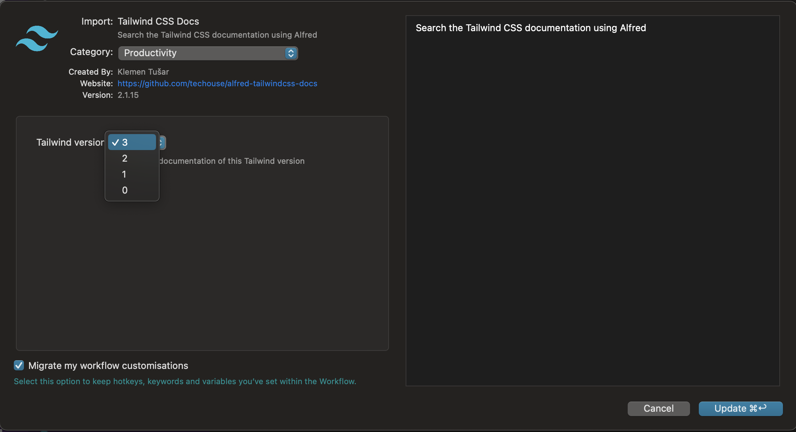

# Tailwind CSS Docs Workflow for Alfred


[](https://github.com/sponsors/techouse)


Search the [Tailwind CSS documentation](https://tailwindcss.com/docs/) using [Alfred](https://www.alfredapp.com/).


## Installation

1. [Download the latest version](https://github.com/techouse/alfred-tailwindcss-docs/releases/latest)
2. Install the workflow by double-clicking the `.alfredworkflow` file
3. You can add the workflow to a category, then click "Import" to finish importing. You'll now see the workflow listed in the left sidebar of your Workflows preferences pane.

## Usage

Just type `twd` followed by your search query.

```
twd background color
```

Either press `⌘Y` to Quick Look the result, or press `<enter>` to open it in your web browser.

## Changing the Tailwind CSS version to search

The workflow supports searching the documentation of several versions. To change the branch, configure the Workflow as show in the image below.



```
twd flex v2
```

### Note

The lightning fast search is powered by [Algolia](https://www.algolia.com) using the _same_ index as the official [Tailwind CSS](https://tailwindcss.com/) website.
